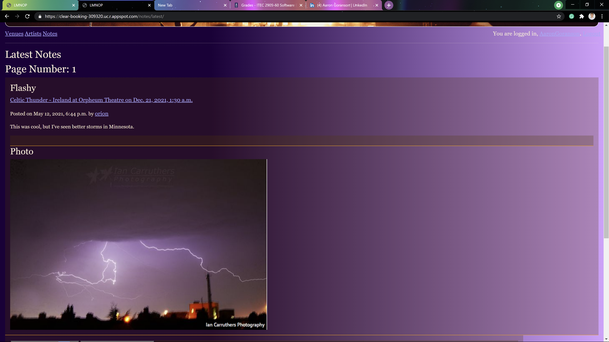
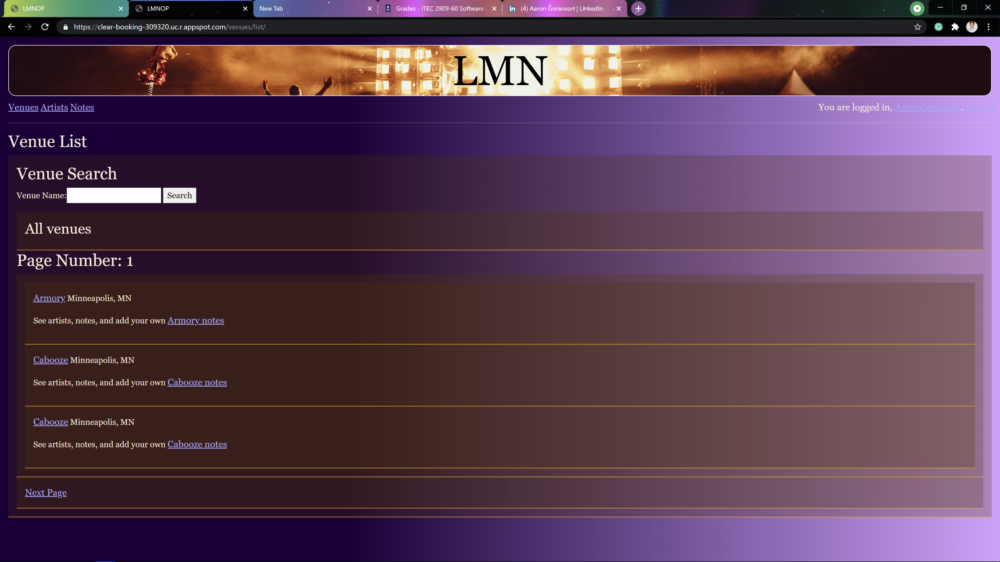
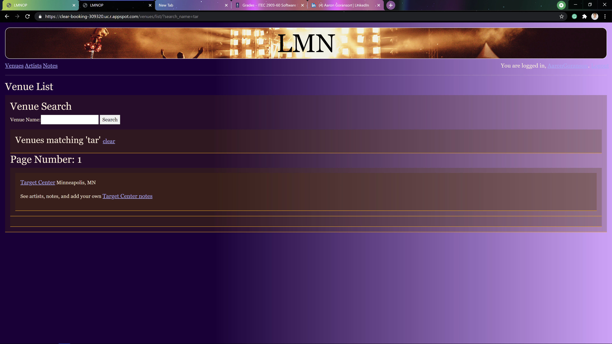

# LMNOP

## Live Music Notes, Opinions, Photographs

This site is a way for you and your friends to rate shows and give your opinions of the shows with notes and photos!!!
You can create user profiles and look at your friends profiles as well!! (So FUN!!)
You can transfer between profiles and view all the local shows at all the local venues!!!!
All of the Artists and Notes are paginated in a great way!!!
You can search all the artists and venues to find specific shows so cool!!

To run locally 
pip install -r requirements.txt
python manage.py runserver

You can run the site directly from
https://clear-booking-309320.uc.r.appspot.com/

Developers
Aaron >:)
Orion :}
Johnny <:)>
Omar |:)|

Here is what the site looks like running

Here is an example of what a note looks like on the site

Here are some example of paginaton on the site!

In the code there is also a great sequence diagram that can show you how all the modules, methods, and classes all work together same with Sphinx Documentation!!

Hope you have fun! 

(Have any suggestions please email one of our developers at sb9561bm@go.minnstate.edu)

